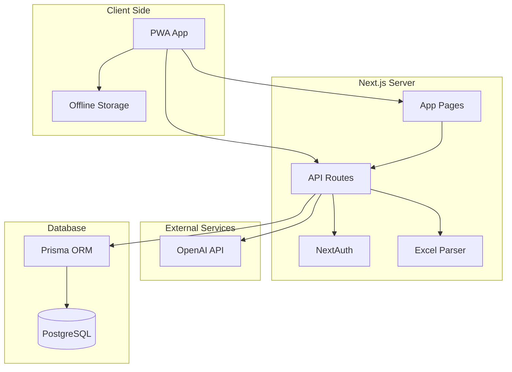
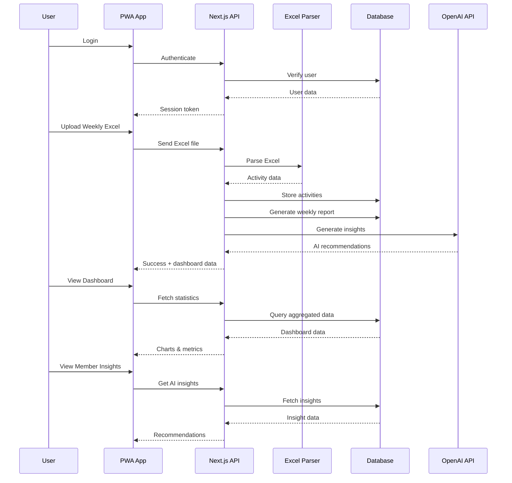

# BNI Dashboard PWA - Simplified Architecture Plan

## Technology Stack

| Component | Technology | Purpose |
|-----------|------------|---------|
| Frontend Framework | Next.js 14+ (App Router) | Full-stack framework with SSR, API routes |
| UI Library | shadcn/ui + Tailwind CSS | Modern, accessible components |
| Database | PostgreSQL | Robust relational database |
| ORM | Prisma | Type-safe database access |
| Authentication | NextAuth.js | Secure authentication |
| Excel Processing | xlsx or SheetJS | Parse Excel files |
| Charts | Recharts | Data visualization |
| AI Integration | OpenAI API | Business insights & recommendations |
| PWA | next-pwa | Offline capabilities |
| State Management | Zustand | Client-side state |

---

## Database Schema (Simplified)

### Users Table
```prisma
model User {
  id            String    @id @default(cuid())
  email         String    @unique
  name          String?
  role          Role      @default(MEMBER)
  createdAt     DateTime  @default(now())
  updatedAt     DateTime  @updatedAt
}
```

### Members Table
```prisma
model Member {
  id              String   @id @default(cuid())
  phoneId         String   @unique
  memberNumber    String   @unique
  name            String
  industry        String
  master          String?
  joinDate        DateTime
  status          MemberStatus @default(ACTIVE)
  activities      Activity[]
  createdAt       DateTime @default(now())
  updatedAt       DateTime @updatedAt
}
```

### Activities Table (from Excel uploads)
```prisma
model Activity {
  id              String   @id @default(cuid())
  memberId        String
  member          Member   @relation(fields: [memberId], references: [id])
  phoneId         String   // Phone ID from member sheet (unique identifier)
  memberName      String   // Store original name for matching
  identity        String?  // 身份
  activityDate    DateTime
  weekNumber      Int      // Week number (1-52)
  year           Int      // Year
  
  // Attendance (出席情况)
  // Possible values: 出席, 缺席, 迟到, 替代人, 请假
  attendance      String   @default("出席")
  
  // Referrals (引荐)
  provideInsideRef    Int   @default(0)  // 提供内部引荐
  provideOutsideRef   Int   @default(0)  // 提供外部引荐
  receivedInsideRef   Int   @default(0)  // 收到内部引荐
  receivedOutsideRef  Int   @default(0)  // 收到外部引荐
  
  // Visitors (来宾)
  visitors        Int      @default(0)
  
  // One-to-One Meetings (一对一会面)
  oneToOneVisit   Int      @default(0)
  
  // Transaction Value (交易价值 - TYFCB)
  tyfcb           Float    @default(0)
  
  // Education (CEU)
  ceu             Float    @default(0)
  
  // Upload metadata
  uploadedAt      DateTime @default(now())
  uploadedBy      String
  
  @@unique([memberId, activityDate])
  @@index([phoneId])
  @@index([weekNumber, year])
}
```

### AI Insights Table
```prisma
model AIInsight {
  id              String   @id @default(cuid())
  memberId        String
  member          Member   @relation(fields: [memberId], references: [id])
  insightType     InsightType
  title           String
  content         String
  recommendations Json?
  createdAt       DateTime @default(now())
}
```

### Weekly Reports Table
```prisma
model WeeklyReport {
  id              String   @id @default(cuid())
  weekNumber      Int
  year            Int
  startDate       DateTime
  endDate         DateTime
  
  // Summary Statistics
  totalMembers    Int
  totalInsideReferrals  Int
  totalOutsideReferrals Int
  totalTYFCB      Float
  totalOneToOneVisits Int
  totalVisitors   Int
  attendanceRate  Float
  totalCEU        Float
  
  // Top Performers
  topReferrers    Json
  topTYFCB        Json
  topOneToOnes    Json
  
  createdAt       DateTime @default(now())
  
  @@unique([weekNumber, year])
}
```

### Terms Table (meeting/term tracking)
```prisma
model Term {
  id              String   @id @default(cuid())
  term            String   // Term/period name
  startTime       DateTime // Start time
  endTime         DateTime // End time
  weekNumber      Int      // Week number (1-52)
  date            DateTime // Date
  isMeeting       Boolean  @default(true)  // Meeting or not
  remarks         String?  // Remarks/notes
  createdAt       DateTime @default(now())
  updatedAt       DateTime @updatedAt
}
```

---

## Enums

```prisma
enum Role {
  ADMIN
  MEMBER
}

enum MemberStatus {
  ACTIVE
  INACTIVE
}

enum InsightType {
  PERFORMANCE
  OPPORTUNITY
  RECOMMENDATION
  PATTERN
}
```

---

## System Architecture



---

## User Flow



---

## Module Breakdown

### 1. Authentication Module
- User registration/login
- Role-based access control (Admin/Member)
- Session management

### 2. Member Management Module
- Initial member Excel upload (one-time setup)
- Member profiles (basic info)
- Add/Edit/Delete members through the app
- Category management
- Member search & filtering
- Handle member status changes (active/inactive/leave)

### 3. Weekly Activity Upload Module
- Excel file upload
- **Column Mapping UI** - Pair Excel columns to database fields
- **Member Matching** - Match activity rows to members by **Name AND Phone_ID**
  - Phone_ID is the unique identifier from member sheet
  - Handles name changes and similar names correctly
- Save column mapping templates for reuse
- Parse and validate Excel data
- Handle Chinese column headers
- Store activities in database with Phone_ID
- Upload history with version tracking
- Handle additional/extra columns gracefully
- Week date selection (YYYYMMDD format, e.g., 20260205)
- Historical data accumulation for trend analysis

### 4. Terms/Meeting Management Module
- Terms/Meeting Excel upload
- Terms tracking (term name, start/end time, week number, date)
- Meeting status (meeting or not)
- Remarks/notes for each term
- Current term display
- Term history
- CRUD operations for terms

### 5. Dashboard Module
- KPI cards (total referrals, TTV, one-to-ones, visitors)
- Weekly/Monthly trends
- Top performers charts
- Attendance rates
- Activity breakdown
- Current term information

### 6. Reports Module
- Weekly summary reports
- Member performance reports
- Export to PDF/Excel
- Custom date range reports

### 7. AI Insights Module
- Analyze member performance patterns
- Generate business recommendations
- Identify opportunities
- Member matching suggestions
- Activity trend analysis

### 8. PWA Features
- Offline mode (view cached data)
- Push notifications (weekly reports ready)
- Install prompts
- Background sync for uploads

---

## Excel Upload Format

### Members Excel Format

| Column | Description | Type | Required |
|--------|-------------|------|----------|
| Phone_ID | Unique phone identifier | String | Yes |
| Member_Number | Member number | String | Yes |
| Name | Member name | String | Yes |
| Industry | Business industry/category | String | Yes |
| Master | Master member (if applicable) | String | No |
| Join_Date | Date joined BNI | Date | Yes |
| Status | Member status (Active/Inactive) | String | Yes |

### Terms/Meeting Excel Format

| Column | Description | Type | Required |
|--------|-------------|------|----------|
| terms | Term/period name | String | Yes |
| start time | Start time | DateTime | Yes |
| end time | End time | DateTime | Yes |
| weekNumber | Week number (1-52) | Number | Yes |
| date | Date | Date | Yes |
| meeting or not | Is meeting | Boolean | Yes |
| remarks | Remarks/notes | String | No |

### Weekly Activity Excel Format

**Chinese Column Headers (Your Actual Excel):**

| Chinese Column | English Translation | Database Field | Type | Required |
|----------------|-------------------|----------------|------|----------|
| 名称 | Name | `memberName` | String | Yes |
| 身份 | Identity | `identity` | String | No |
| 出席情况 | Attendance Status | `attendance` | String | Yes |
| 提供内部引荐 | Provide Inside Referrals | `provideInsideRef` | Number | Yes |
| 提供外部引荐 | Provide Outside Referrals | `provideOutsideRef` | Number | Yes |
| 收到内部引荐 | Receive Inside Referrals | `receivedInsideRef` | Number | Yes |
| 收到外部引荐 | Receive Outside Referrals | `receivedOutsideRef` | Number | Yes |
| 来宾 | Visitors | `visitors` | Number | Yes |
| 一对一会面 | One-to-One Meeting | `oneToOneVisit` | Number | Yes |
| 交易价值 | Transaction Value | `tyfcb` | Number | Yes |
| CEU | CEU | `ceu` | Number | Yes |

**Attendance Status Values:**
- 出席
- 缺席
- 迟到
- 替代人
- 请假

**Note:**
- The app will match members by **Name** (名称) AND **Phone_ID** from the member sheet
- Phone_ID is the unique identifier that works even when member names change or are similar
- Activity date will be captured from the upload date (YYYYMMDD format like 20260205)
- Week number and year are calculated from the activity date for trend analysis
- The app includes a **Column Mapping** feature to pair Excel columns with database fields
- Supports both Chinese and English column names
- Weekly data accumulates over time for historical analysis (last month, last year, etc.)

---

## API Routes Structure

```
/api
  /auth
    /login
    /logout
  /members
    / [GET, POST]
    /[id] [GET, PUT, DELETE]
    /search
  /activities
    /upload/members [POST] - Members Excel upload
    /upload/weekly [POST] - Weekly Activity Excel upload
    /upload/weekly/parse [POST] - Parse Excel and return columns for mapping
    /upload/weekly/save-mapping [POST] - Save column mapping template
    /upload/weekly/mappings [GET] - Get saved mapping templates
    /upload/weekly/match-members [POST] - Match activity rows to members by name AND phone_id
    / [GET]
    /member/[id]
    /week/[week]/[year]
    /history [GET] - Get historical activity data for trend analysis
  /terms
    / [GET, POST]
    /[id] [GET, PUT, DELETE]
    /upload [POST] - Terms Excel upload
    /current [GET] - Get current term
  /reports
    /weekly/[week]/[year]
    /member/[id]
    /export
  /dashboard
    /summary
    /trends
    /top-performers
  /ai
    /insights/[memberId]
    /recommendations
    /analyze
```

---

## Page Structure

```
/
  /login
  /dashboard
    / [main dashboard]
    /members [member list]
    /activities [activity history]
    /reports [reports list]
  /members
    / [list]
    /[id] [profile & insights]
    /new [create member]
  /activities
    / [list]
    /upload/members [upload members Excel]
    /upload/weekly [upload weekly activity Excel]
    /upload/weekly/mapping [column mapping UI]
  /terms
    / [list]
    /upload [upload terms Excel]
    /new [create term]
  /reports
    / [list]
    /weekly
    /member/[id]
  /settings
    /profile
```

---

## Dashboard Components

### KPI Cards
- Total Inside Referrals (This Week/Month)
- Total Outside Referrals (This Week/Month)
- Total TYFCB Value (This Week/Month)
- 1-to-1 Visits
- Visitors
- Attendance Rate
- CEU Points

### Charts
1. **Weekly Trends** - Line chart showing activity over time
2. **Member Performance** - Bar chart comparing members
3. **Referral Breakdown** - Inside vs Outside referrals
4. **Top Performers** - Leaderboard for referrals, TYFCB, 1-to-1 visits
5. **Industry Distribution** - Pie chart of member industries

### Tables
- Recent activities
- Member ranking by industry
- Weekly summary
- TYFCB leaderboard

---

## AI Features

### 1. Member Performance Analysis
- Identify top referrers (inside/outside)
- Detect declining performance
- Compare against chapter averages
- Track TYFCB trends

### 2. Business Recommendations
- Suggest networking opportunities based on industry
- Recommend potential referral partners
- Identify industries with low referral activity
- Suggest 1-to-1 meeting targets

### 3. Pattern Recognition
- Seasonal trends in referrals and TYFCB
- Correlation between 1-to-1 visits and referral success
- Success patterns by industry
- Attendance impact on performance

### 4. Member Matching
- Find complementary businesses across industries
- Suggest 1-to-1 pairings for cross-referrals
- Identify referral opportunities between members
- Match visitors to relevant members

---

## Security Considerations

1. **Authentication**: JWT tokens with refresh mechanism
2. **Authorization**: Role-based access control (Admin/Member)
3. **Data Validation**: Zod schemas for all inputs
4. **File Upload**: Validate Excel format and content
5. **SQL Injection Prevention**: Prisma ORM with parameterized queries
6. **XSS Prevention**: React's built-in escaping
7. **HTTPS**: Required for production

---

## Performance Optimization

1. **Code Splitting**: Next.js automatic code splitting
2. **Data Caching**: React Query for data caching
3. **Lazy Loading**: Components and routes
4. **Database Indexing**: Proper indexes on frequently queried fields
5. **Service Worker**: Offline caching strategy

---

## Deployment Options

1. **Vercel**: Recommended for Next.js (free tier available)
2. **Railway**: Full-stack deployment with PostgreSQL
3. **Render**: Alternative deployment platform

---

## Development Phases

### Phase 1: Foundation
- Project setup with Next.js + PWA
- Database setup (PostgreSQL + Prisma)
- Authentication (NextAuth.js)
- Basic UI layout with shadcn/ui

### Phase 2: Core Features
- Member management (CRUD) with Phone_ID and Member_Number
- Excel upload and parsing (Members and Weekly Activity)
- Activity storage with all BNI metrics
- Basic dashboard with KPIs (referrals, TYFCB, 1-to-1, visitors)

### Phase 3: Reports & Visualizations
- Charts and graphs (inside/outside referrals, TYFCB trends)
- Weekly reports by industry
- Export functionality (PDF/Excel)
- Member performance views by industry
- CEU tracking

### Phase 4: AI Integration
- AI insights generation based on BNI metrics
- Business recommendations by industry
- Pattern analysis (referrals vs 1-to-1 visits)
- Member matching across industries
- Visitor-to-member matching

### Phase 5: PWA & Polish
- Offline capabilities
- Push notifications
- Performance optimization
- Testing & deployment
